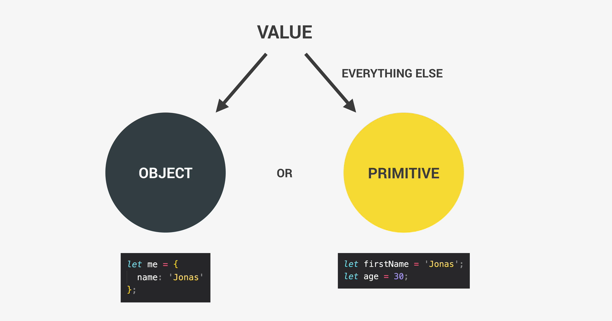

# Variables in JavaScript

## 1. What is a Variable?

A variable in JavaScript is a container for storing data values. Think of it as a "label" attached to a box that holds data, and you can change the contents of the box at any time.

In JavaScript, we use variables to store:
- **Text** (strings)
- **Numbers**
- **Booleans** (true or false)
- **Arrays**, **Objects**, and more.

## 2. Declaring Variables

To declare a variable, you use the let, const, or var keyword. The most commonly used today are let and const.

### 2.1 let

Used to declare variables that can change their value over time.


```javascript
let age = 25;  // Declare a variable 'age' and assign the value 25
age = 26;  // Re-assign a new value to 'age'
```
### 2.2 const

Used to declare variables whose values should not be reassigned (constant values).
Useful for values that will never change (e.g., mathematical constants).


```javascript
const PI = 3.1415;  // Declare a constant variable 'PI'
```

### 2.3 var (Older)

Used in older JavaScript versions but can still be used.
Not recommended today because of its function-scoped behavior.


```javascript
var oldVariable = "This is outdated";  // 'var' is function-scoped and should be avoided in modern JavaScript
```

## 3. Valid and Invalid Variable Names  

JavaScript has specific rules and best practices for naming variables:  

### 🔹 Rules for Naming Variables  
- Variable names can include **letters, numbers, underscores (`_`)**, and **dollar signs (`$`)**.  
- The name **must start** with a **letter, underscore, or dollar sign**.  
- A variable name **cannot start with a number**.  
- JavaScript is **case-sensitive** → `myVariable` and `MyVariable` are treated as different variables.  
- Variable names **cannot use reserved JavaScript keywords** (e.g., `let`, `class`, `return`).  
- Names should be **descriptive** and follow **camelCase** convention.  


### Valid Variable Names:

```javascript
let firstName = "Mohamed";  // Valid
let _lastName = "Ali";  // Valid
let $age = 30;  // Valid
let myFirstJob = 'Programmer'; // Descriptive - good!
```

### ❌ Invalid Variable Names:

```javascript
let 1stName = "Mohamed";  // Invalid, can't start with a number
let my-name = "Ali";  // Invalid, hyphens are not allowed
let jonas&matilda = 'JM'; // No special characters
let new = 27;             // Cannot use reserved keyword
```

### ⚠️ Less Descriptive (Avoid)
```js
let job1 = 'Programmer';
let job2 = 'Teacher';
```
## 4.Values and Variables


**Values** are the most fundamental unit of information in programming – pieces of data we want to use or store.  
We can store these values in **variables** to reuse them.  

### 🔹 Examples of Values
```js
console.log('Jonas');   // String value
console.log(23);        // Number value
console.log(23 + 7);    // Expression creating a new value (30)
```
### 🔹 Storing Values in Variables

```js
let firstName = 'Jonas';
console.log(firstName);
console.log(firstName);
```

## 5. Variable Types (Data Types)




In JavaScript, variables can store different kinds of data.  
Data types are divided into **primitive types** (basic, immutable values) and **object types** (complex, mutable structures).

---

### 🔹 Primitive Data Types

**1. String** – A sequence of characters, wrapped in quotes.  
```javascript
let name = "John";
```
**2. Number** – Numeric values (both integers and decimals).

```javascript
let age = 25;
let price = 19.99;
```
**3. Boolean** – Logical values: true or false.

```javascript
let isStudent = true;
```
**4. Undefined** – A variable declared but not assigned a value.

```javascript
Copy code
let score;
console.log(score); // undefined
```
**5. Null** – An intentional “empty” or “nothing” value.

```javascript
let selectedUser = null;
```

**6. Symbol (ES2015)** – A unique and immutable value, often used as object keys.

```javascript
const id = Symbol("id");
```
**7. BigInt (ES2020)** – Represents very large integers beyond the Number limit.

```javascript
let bigNumber = 123456789012345678901234567890n;
```

### 🔹 Object (Non-Primitive) Data Types

**1. Array** – An ordered collection of values.

```javascript
let fruits = ["apple", "banana", "cherry"];
```

**2. Object** – A collection of key–value pairs.

```javascript
let person = { name: "John", age: 25 };
```

**3. Function** – A reusable block of code (functions are also objects in JavaScript).

```javascript
function greet() {
  console.log("Hello World!");
}
```

## 5. Tips for Working with Variables

- Use meaningful names for your variables to make your code easier to understand.

- Be consistent with your naming conventions (e.g., camelCase for multi-word variables).

- Avoid using reserved keywords (e.g., `let`, `const`, `if`, `for`).


